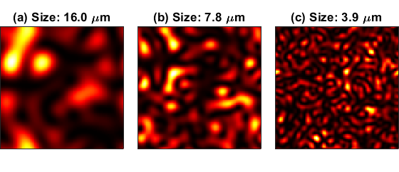

# Code for WASPAA 2021 paper on SuperResolution PhotoAcoustic Tomography (SR-PAT)

This repo contains the code we used to run the experiments in our paper 

> O. A. Malik, V. V. Narumanchi, S. Becker and T. W. Murray. 
> *Superresolution photoacoustic tomography using random speckle illumination and second order moments*.
> **IEEE Workshop on Applications of Signal Processing to Audio and Acoustics (WASPAA)**,
> pp. 141-145, 2021.

The paper is available on [IEEE Xplore](https://doi.org/10.1109/WASPAA52581.2021.9632758) and [arXiv](https://arxiv.org/abs/2105.03809). 
The code can be used to recreate Figures 3-5 in the paper.


## Referencing this code

If you use this code in any of your own work, please reference our paper:
```
@INPROCEEDINGS{9632758,
  author={Malik, Osman Asif and Narumanchi, Venkatalakshmi Vyjayanthi and Becker, Stephen and Murray, Todd W.},
  booktitle={2021 IEEE Workshop on Applications of Signal Processing to Audio and Acoustics (WASPAA)}, 
  title={Superresolution Photoacoustic Tomography Using Random Speckle Illumination and Second Order Moments}, 
  year={2021},
  volume={},
  number={},
  pages={141-145},
  doi={10.1109/WASPAA52581.2021.9632758}}
```


## Requirements

In order to run the k-Wave reconstructions, the k-Wave toolbox for Matlab is required.
It is available for free on the [k-Wave website](http://www.k-wave.org/).

Please let me know if you run into any Matlab compatibility issues. 
I'm able to run this in Matlab R2021b, so that version or a newer one should run fine.


## Step-by-step instructions for recreating paper plots

There is no single script to run that recreates the plots in the paper. 
However, the steps below should let you recreate the results (i.e., plots) in our paper.

1. The first step is to run `waspaa_experiments.m` a total of *six times* for appropriate parameter values.
The script needs to be run multiple times to generate the outputs for the two different transducer array geometries (circular and square) and the three different speckle granularities. 
Leave all parameters as they are, except for the parameters `r` and `transducer_setting`.
The script should be run for the following values of those parameters:
    - `r = 3` and `transducer_setting = 'surface array'`
    - `r = 6` and `transducer_setting = 'surface array'`
    - `r = 12` and `transducer_setting = 'surface array'`
    - `r = 3` and `transducer_setting = 'circular'`
    - `r = 6` and `transducer_setting = 'circular'`
    - `r = 12` and `transducer_setting = 'circular'` 

2. The next step is to run the k-Wave reconstructions for the square and circular transducer array geometries.
This is done by running the scripts `kWave_reconstruction_square.m` and `kWave_reconstruction_circular.m`, respectively.
Note that these scripts require k-Wave; see the Requirements heading above.
These two scripts use an average signal and the transducer positions generated in `waspaa_experiments.m`, so it's important that step 1 is done before this step.

3. Run `plot_waspaa_experiments_speckles.m` to recreate the plot in Figure 3.
The figure below shows an example.
Since the speckle patterns are random, they won't look exactly like in the paper.



4. Run `plot_waspaa_experiments.m` to recreate the plots in Figures 4 and 5.
Setting `plot_circ = false` will generate the plot for the square transducer array (Fig. 4).
Setting `plot_circ = true` will generate the plot for the circular transducer array (Fig. 5). 
The two figures below show the recreations of Figures 4 and 5, respectively.
Again, due to randomness in the speckle patterns, they won't be exactly identical to the ones in the paper.


## Author contact information

Please feel free to contact me at any time if you have any questions or would like to provide feedback on this code or on the paper. I can be reached at `oamalik (at) lbl (dot) gov` or at `osman (dot) malik (at) colorado (dot) edu`. 
